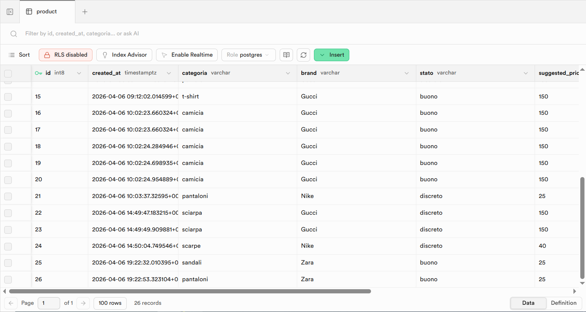

# 🧠 LookBook AI – Backend

[](https://lookbook-backend-uxi1.onrender.com/)

Backend dell’applicazione **LookBook AI**, che utilizza l’intelligenza artificiale per stimare il prezzo di capi di abbigliamento usati e salva i dati su database.

---

## 🚀 Tecnologie utilizzate
- Node.js  
- Express  
- OpenAI API  
- Supabase (PostgreSQL)  
- CORS  

---

## ⚙️ Funzionalità principali

### 📌 POST /valuta
Riceve:
- categoria  
- brand  
- stato  

👉 Chiama l’AI per stimare:
- prezzo suggerito  
- range di prezzo  
- motivazione  
- consigli di vendita  

👉 Salva i dati nel database Supabase  
👉 Restituisce il risultato al frontend  

---

### 📌 GET /prodotti
👉 Recupera tutti i prodotti salvati nel database  

---

## 🗄️ Database
- Database PostgreSQL su Supabase  
- Tabella: `product`  
- I dati vengono salvati in tempo reale  


---

## 🌐 Deploy & Link API
- Backend deployato su Render  
- API disponibile online: https://lookbook-backend-uxi1.onrender.com/
(Visita la root per un messaggio di test del backend)

---

## 🔐 Variabili d’ambiente

```env
OPENAI_API_KEY=
SUPABASE_URL=
SUPABASE_KEY=
PORT=
```

---

## 👨‍💻 Autore
🦁 **Luciano Pacini**

---

## 📌 Note
Questo progetto rappresenta una prima implementazione full stack con integrazione AI e persistenza dei dati.